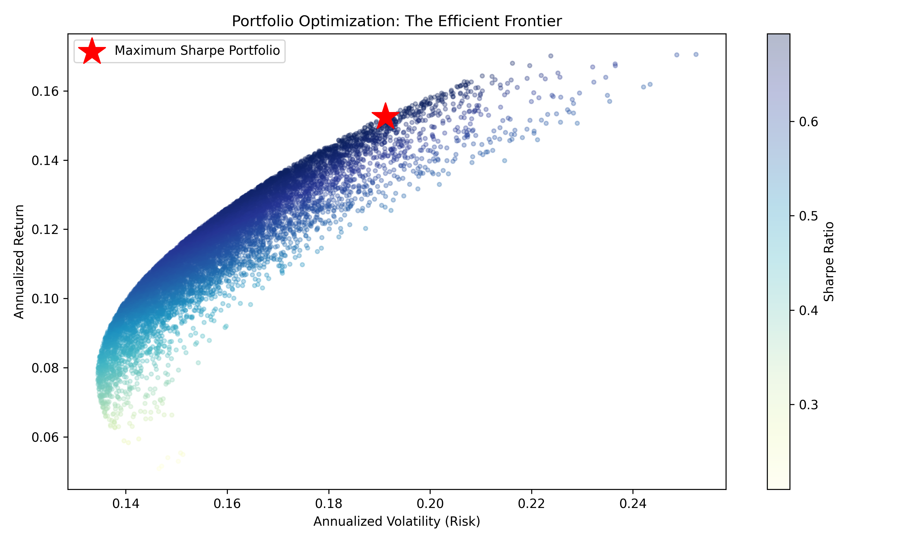

# Portfolio Optimization & Risk Analysis Tool 📈


## Project Overview
This project applies Modern Portfolio Theory (MPT) to construct an optimal investment portfolio. By pulling historical stock market data via the Yahoo Finance API, the tool mathematically determines the exact asset allocation required to maximize expected returns for a given level of risk.

The core optimization algorithm minimizes the negative Sharpe Ratio using Sequential Least Squares Programming (SLSQP), providing actionable insights for wealth management and quantitative trading strategies.

## Business Value
* **Data-Driven Allocation:** Replaces intuitive investing with rigorous mathematical optimization, ensuring the maximum excess return per unit of risk.
* **Risk Management:** Calculates annualized volatility and utilizes covariance matrices to account for cross-asset correlations, lowering overall portfolio risk.
* **Automated Financial Analysis:** Rapidly ingests live market data to rebalance portfolios dynamically.

## Technical Architecture
* **Language:** Python
* **Libraries:** NumPy, Pandas, SciPy (Optimization), yfinance, Matplotlib
* **Key Metrics Calculated:** Annualized Return, Annualized Volatility (Risk), Sharpe Ratio, Covariance.

## The Efficient Frontier
The model simulates 10,000 random portfolio weightings to plot the Efficient Frontier. The red star indicates our mathematically optimal portfolio, representing the highest achievable Sharpe Ratio for this specific basket of assets (AAPL, JPM, KO, JNJ).


*(Note: Ensure the `efficient_frontier.png` file is in the same folder as this README on GitHub for the image to display).*

## How to Run the Project Locally

1. **Clone the repository:**
   ```bash
   git clone [https://github.com/yourusername/portfolio-optimizer.git](https://github.com/yourusername/portfolio-optimizer.git)
   cd portfolio-optimizer
